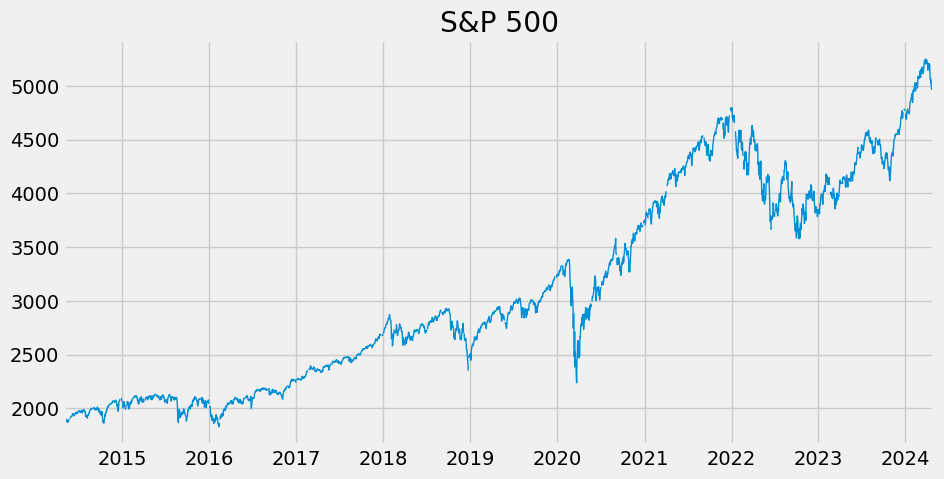

# Introduction

This project involved economic data analysis using Python's pandas library. This included data retrieval for diverse economic indicators, data cleaning and merging, and leveraging the Fred API for real-time data access. The project facilitated comparison, analysis, and exploration, specifically focusing on state-wise percentages of unemployment rates and participation rates.

- Source material: https://www.youtube.com/watch?v=R67XuYc9NQ4A
- Author credits: Rob Mulla

# Results

